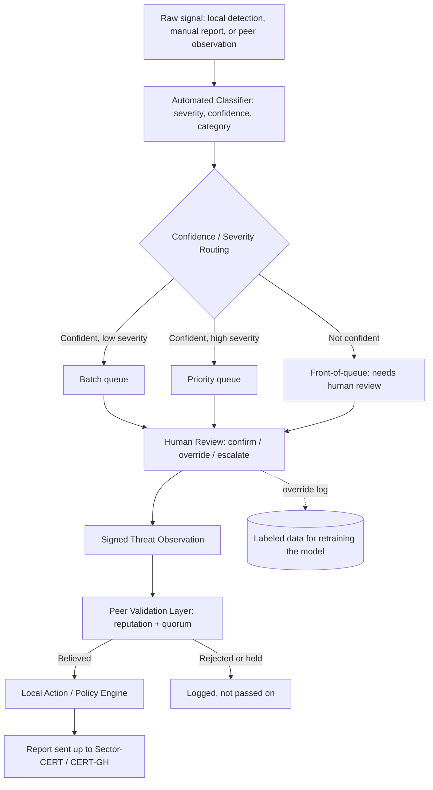

# Architecture

Terms in *italics* are defined in the [glossary](glossary.md) the first
time they appear.

## The five-layer core

- **Local Collection Layer.** Each simulated institution's *[node](glossary.md#node)*
  gathers its own local threat data. FLOD's DDoS detection is used as one
  real source for this; other kinds of threats (phishing, brute-force
  attempts) use sample data instead of building a full detector for each
  one.

- **Intelligence Extraction Layer.** Turns a raw local signal into a
  shareable *[Threat Observation](glossary.md#threat-observation)*
  with any private details stripped out. The format is a smaller version
  of *[STIX](glossary.md#stix)*,
  a standard other threat-sharing tools use, though this project does not
  need or aim for full compatibility with that standard.

- **Federation Layer.** Handles how *[nodes](glossary.md#node)*
  find each other, prove who they are, sign their messages, and pass
  reports around. It does not need to work at internet scale: a short,
  fixed list of simulated nodes is enough for this project.

- **Peer Validation Layer (the main research contribution).** When a node
  receives a report from a *[peer](glossary.md#peer)*,
  it has to decide: believe it, wait for more evidence, or reject it. This
  project answers that with a
  *[reputation-weighted quorum](glossary.md#reputation-weighted-quorum)*:
  each peer's past reports earn or lose it trust over time, and a new
  report is believed once enough trust-weighted peers back it up,
  rejected if enough weighted peers contradict it, and otherwise held
  pending more evidence.

- **Local Action Layer.** Each node decides what to do with intelligence
  once it is believed: store it, alert someone, or block the source. This
  reuses ideas from how FLOD separates "what was detected" from "what to
  do about it," not any of FLOD's actual code.

## Extended workflow, with automated classification

Added on top of the five layers above, after confirming CERT-GH's current
process is done entirely by hand (see [feasibility.md](feasibility.md)):

1. **Local signal ingestion.** A raw signal comes in from local detection
   tools, a manually typed-in report, or an incoming peer report.
2. **Automated classification.** A locally trained model looks at the
   signal and produces three things: how severe it looks, how confident
   the model is, and what category it falls into. The model never acts on
   its own; it only produces this scored summary for a person to review.
3. **Threshold routing.** Confident, low-severity signals wait in a batch
   queue; confident, high-severity signals go straight to the top of the
   queue; anything the model is unsure about, regardless of severity, also
   goes to the front, because the model is never allowed to quietly drop
   something it doesn't understand.
4. **Human review.** A person confirms, overrides, or escalates each
   signal. Every override is recorded, both as proof a person made the
   final call and as future training data to improve the model.
5. **Peer validation layer.** Once a person has confirmed a signal (or the
   model was confident enough to skip straight through), it is signed and
   sent to peers, who each run it through their own Peer Validation Layer
   as described above.
6. **Local action.** Each node acts on intelligence once it is believed,
   per its own Local Action Layer.
7. **Upward reporting.** Believed, classified intelligence is still
   forwarded on to CERT-GH or the relevant sector body. This system sits
   underneath that existing national reporting channel and feeds it
   faster, better-sorted information; it does not replace it.

## Platform base and technology split

**Platform: OpenCTI.** [OpenCTI](glossary.md#opencti)
Community Edition is reused as-is for storage and the browsing interface,
rather than modified, so the limited build time available goes toward
this project's own two original pieces: the classifier and the Peer
Validation Layer.
[MISP](glossary.md#misp)
was considered as an alternative platform first; OpenCTI's more active
development and its way of storing relationships between records was
judged the better fit, though a couple of MISP's own features (marking
independent sightings of the same indicator, and built-in message
signing) were kept in mind as useful reference points.

**Peer validation layer: Rust.** Built as its own separate program, not
inserted into OpenCTI's own code, talking to OpenCTI over
*[GraphQL](glossary.md#graphql)*.
Rust was chosen for this piece because its networking and
cryptographic-signing code benefits from the speed and low-level control
the language gives.

**Classifier: Python.** Also its own separate program talking to OpenCTI
over GraphQL, written in Python for its mature set of machine-learning
tools.

Keeping the platform untouched and both original pieces as separate
programs keeps this project's own work clearly separate from the reused
platform's code.

### Licensing obligations from reusing OpenCTI

OpenCTI is released under the Apache 2.0 license, which permits reuse and
modification but comes with a few obligations if any of its own files are
directly edited: any edited file must say plainly that it was changed, and
OpenCTI's own copyright and trademark notices must stay in place. New code
written for this project does not have to use the same license, though
keeping the whole repository under Apache 2.0 is simpler and is what this
repository does. In practice: any touched OpenCTI file keeps its original
license header plus a note of what changed, and OpenCTI and its maker,
Filigran, are credited here and in the final report.

## Why the classifier is trained, not reused from elsewhere

An existing open-source model called VLAI, trained to score the severity
of software vulnerabilities from over 600,000 vulnerability descriptions,
was considered as a starting point. Two things ruled it out:

First, VLAI is trained to read vulnerability descriptions, a different
kind of input from what this project needs to read (DDoS traffic
patterns, phishing indicators, brute-force login attempts). It would not
have produced a working classifier for this project's actual inputs.

Second, building on someone else's pretrained model would have made it
harder to show this project's own contribution is original work. Training
a new model from scratch, on data generated and labeled specifically for
this project (starting with FLOD's DDoS output), settles both problems at
once.

The classifier itself is a
*[gradient-boosted-trees](glossary.md#gradient-boosted-trees)*
model over a small set of hand-picked measurements (packets per second,
how many different source addresses are involved, and similar, for the
DDoS category). This kind of model was chosen over a larger,
from-scratch deep-learning model because the amount of training data
available is realistic for it, it trains quickly enough to iterate on
within the project's timeline, and it can show
*[which measurements mattered most](glossary.md#feature-importance)*
to a given decision, which is useful both for writing up results and for
a human reviewer's confidence in why something was flagged.

## Relationship to FLOD

This project is not an extension of
[FLOD](https://github.com/DevInBlack001/ddos-reduction-system), a
separate project that detects and blocks one kind of flood of traffic at
a single point in a network. This project is a multi-institution
trust-and-sharing system instead. What carries over from FLOD is design
experience only: specifically, the habit of keeping "what was detected"
and "what to do about it" as separate, independent decisions. No code,
no shared design, and no shared research question carry over.
