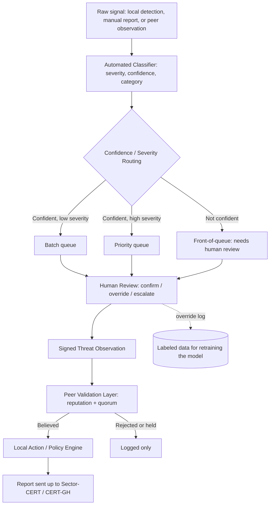

# Architecture

Terms in *italics* are defined in the [glossary](glossary.md) the first
time they appear.

## The five-layer core

- **Local Collection Layer.** Each simulated institution's *[node](glossary.md#node)*
  gathers its own local threat data. FLOD's DDoS detection is the first
  real source for this, built and tested in the `collection/` package
  (see [ROADMAP.md](ROADMAP.md#completed)). Brute-force attempts get the
  same treatment: a real detector against real, live-simulated attack
  traffic in the VM testbed, the same pattern as DDoS, since the testbed
  already exists to support it. Phishing stays sample data, generated
  fresh by a script every time it's needed, never a static fixture file
  checked into the repository, since full phishing infrastructure is
  disproportionate cost for one demo scenario.

- **Intelligence Extraction Layer.** Turns a raw local signal into a
  shareable *[Threat Observation](glossary.md#threat-observation)*
  with any private details stripped out. The format is a smaller version
  of *[STIX](glossary.md#stix)*,
  a standard other threat-sharing tools use, though this project does not
  need or aim for full compatibility with that standard.

- **Federation Layer.** Handles how *[nodes](glossary.md#node)*
  find each other, prove who they are, sign their messages, and pass
  reports around. It does not need to work at internet scale: a short,
  fixed list of simulated nodes is enough for this project.

- **Peer Validation Layer (the main research contribution).** When a node
  receives a report from a *[peer](glossary.md#peer)*,
  it has to decide: believe it, wait for more evidence, or reject it. This
  project answers that with a
  *[reputation-weighted quorum](glossary.md#reputation-weighted-quorum)*:
  each peer's past reports earn or lose it trust over time, and a new
  report is believed once enough trust-weighted peers back it up,
  rejected if enough weighted peers contradict it, and otherwise held
  pending more evidence.

- **Local Action Layer.** Each node decides what to do with intelligence
  once it is believed: store it, alert someone, or block the source. This
  reuses the design habit of keeping "what was detected" separate from
  "what to do about it," a lesson carried over from FLOD.

## Extended workflow, with automated classification

Added on top of the five layers above, after confirming CERT-GH's current
process is done entirely by hand (see [feasibility.md](feasibility.md)):

1. **Local signal ingestion.** A raw signal comes in from local detection
   tools, a manually typed-in report, or an incoming peer report.
2. **Automated classification.** A locally trained model looks at the
   signal and produces three things: how severe it looks, how confident
   the model is, and what category it falls into. The model never acts on
   its own; it only produces this scored summary for a person to review.
3. **Threshold routing.** Confident, low-severity signals wait in a batch
   queue; confident, high-severity signals go straight to the top of the
   queue; anything the model is unsure about, regardless of severity, also
   goes to the front, because the model is never allowed to quietly drop
   something it doesn't understand.
4. **Human review.** A person confirms, overrides, or escalates each
   signal. Every override is recorded, both as proof a person made the
   final call and as future training data to improve the model.
5. **Peer validation layer.** Once a person has confirmed a signal (or the
   model was confident enough to skip straight through), it is signed and
   sent to peers, who each run it through their own Peer Validation Layer
   as described above.
6. **Local action.** Each node acts on intelligence once it is believed,
   per its own Local Action Layer.
7. **Upward reporting.** Believed, classified intelligence is still
   forwarded on to CERT-GH or the relevant sector body. This system sits
   underneath that existing national reporting channel and feeds it
   faster, better-sorted information; it does not replace it.

## This project's own system stands on its own

Every layer above (collection, extraction, federation, peer validation,
local action) is this project's own standalone set of programs, run by
each node. None of it needs any particular downstream platform to exist,
and nothing here loads into, or is loaded by, someone else's software.
The pieces this project owns talk to whatever storage/browsing platform
a node chooses the same way the Local Collection Layer talks to FLOD:
through a small, swappable interface.

- **Reading local data in** uses a *[source connector](glossary.md#source-connector)*.
  FLOD is the first one; a different kind of local detector, or none at
  all, plugs into the same interface without touching anything else.
- **Writing believed results out** uses the same idea in the other
  direction, a swappable *[sink](glossary.md#sink)*, and every node can
  configure several at once. [OpenCTI](glossary.md#opencti) is the
  storage and browsing sink this project has been testing against, used
  once the Peer Validation Layer has already decided an observation is
  believed; a peer node, once the Federation Layer exists, is the same
  kind of sink, addressed through the federation layer's own signed
  message exchange. A node eventually configures as many sinks as it
  needs, its platform (or several) and its peers together, and every
  believed observation fans out to all of them at once.

Anyone running this system (including this project itself) installs
standard OpenCTI Community Edition from
[Filigran's own official channel](https://github.com/OpenCTI-Platform/opencti),
the same way anyone would install any other piece of software this
project depends on.

*[MISP](glossary.md#misp)* was considered as an alternative sink before
settling on OpenCTI for testing; OpenCTI's more active development and
its way of storing relationships between records was judged the better
fit, though a couple of MISP's own features (marking independent
sightings of the same indicator, and built-in message signing) were kept
in mind as useful reference points.

**Peer validation layer: Rust.** Talks to whatever sink is configured
over *[GraphQL](glossary.md#graphql)* (OpenCTI's own interface, when
OpenCTI is the sink in use). Rust was chosen for this piece because its
networking and cryptographic-signing code benefits from the speed and
low-level control the language gives.

**Classifier: Python.** Also its own separate program, written in
Python for its mature set of machine-learning tools.

### On OpenCTI's own licensing

OpenCTI Community Edition is Apache 2.0. Its public repository also
contains a separate, larger set of Enterprise Edition features under a
different, much more restrictive license, gated behind an activation
key that this project never sets, so those features stay dormant.
Installing OpenCTI as an external dependency, the way whoever runs this
system installs it straight from Filigran's own official channel, keeps
this project's own work, and anything built on it, clear of that
separate license entirely. See [decision-record.md](decision-record.md)
for the full reasoning.

## Why the classifier is trained from scratch

An existing open-source model called VLAI, trained to score the severity
of software vulnerabilities from over 600,000 vulnerability descriptions,
was considered as a starting point. Two things ruled it out:

First, VLAI is trained to read vulnerability descriptions, a different
kind of input from what this project needs to read (DDoS traffic
patterns, phishing indicators, brute-force login attempts). It would not
have produced a working classifier for this project's actual inputs.

Second, building on someone else's pretrained model would have made it
harder to show this project's own contribution is original work. Training
a new model from scratch, on data generated and labeled specifically for
this project (starting with FLOD's DDoS output), settles both problems at
once.

The classifier itself is a
*[gradient-boosted-trees](glossary.md#gradient-boosted-trees)*
model over a small set of hand-picked measurements (packets per second,
how many different source addresses are involved, and similar, for the
DDoS category). This kind of model fits the amount of training data
actually available, trains quickly enough to iterate on within the
project's timeline, and can show
*[which measurements mattered most](glossary.md#feature-importance)*
to a given decision, which is useful both for writing up results and for
a human reviewer's confidence in why something was flagged.

