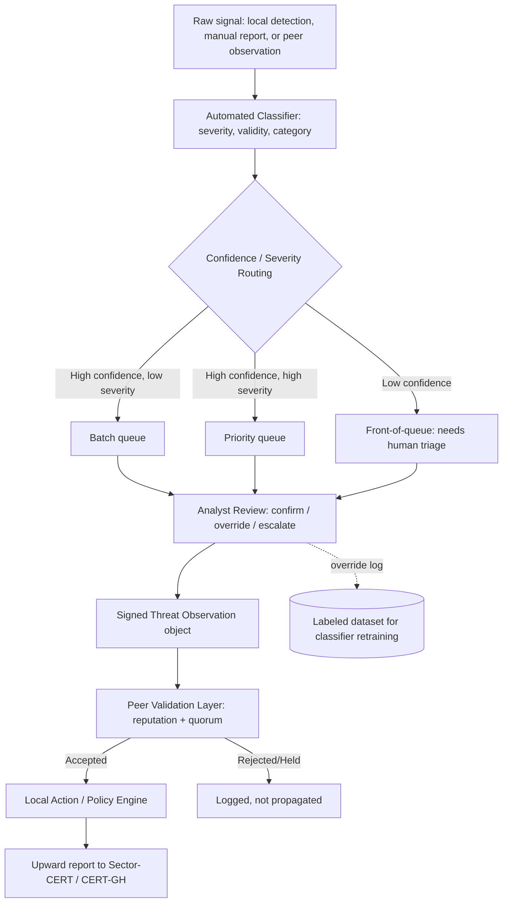

# Architecture

## The five-layer core

- **Local Collection Layer.** Each simulated institution ingests local threat
  data. FLOD's detection output is used as a real data source for the DDoS
  indicator type; other indicator types use synthetic or sample data rather
  than building five full detection engines from scratch.

- **Intelligence Extraction Layer.** Converts raw local signals into a
  shareable, privacy-stripped Threat Observation object. A STIX-lite schema
  is used; full STIX/TAXII compliance is not required for this scope, though
  the STIX 2.1 data model was reviewed to design the schema deliberately
  rather than arbitrarily.

- **Federation Layer.** Peer discovery, identity, message signing, and
  routing between nodes. Does not need to be internet-scale: a fixed or
  semi-dynamic peer list among simulated nodes is appropriate here.

- **Peer Validation Layer (the primary research contribution).** A node
  receiving a peer's observation decides: accept, hold (pending further
  corroboration), or reject. Implemented as a reputation-weighted quorum:
  each peer carries a decaying reputation score, updated by whether its past
  reports were corroborated or contradicted. An observation is accepted once
  weighted corroboration crosses a threshold, rejected if weighted
  contradiction outweighs support, or held if neither condition is met yet.

- **Local Action Layer.** Each node applies its own policy engine to
  accepted, classified intelligence (store / alert / block), reusing FLOD's
  tiered-enforcement thinking as design experience, not as shared code.

## Extended workflow, with automated classification

Added on top of the five-layer core, after confirming CERT-GH's current
triage process is manual (see [feasibility.md](feasibility.md)):

1. **Local signal ingestion.** A raw signal arrives from local detection
   tooling, a manually submitted report, or an inbound peer observation.
2. **Automated classification.** The signal is passed through a locally
   trained classifier producing a severity estimate, a validity/confidence
   score, and a category label. The model never auto-publishes or
   auto-blocks on its own; it produces a scored, structured object only.
3. **Threshold routing.** High-confidence/low-severity observations queue
   for batch review; high-confidence/high-severity observations surface
   immediately at the top of the analyst queue; low-confidence observations
   of any severity go to the front of the queue for mandatory human triage.
   The model is never permitted to silently drop what it is unsure about.
4. **Human review.** The analyst confirms, overrides, or escalates. Every
   override is logged, both as evidence the human retained final authority
   and as future labeled training data for improving the classifier.
5. **Peer validation layer.** A human-confirmed (or high-confidence
   auto-accepted) observation is packaged as a signed Threat Observation
   object and broadcast to peers, who run it through their own Peer
   Validation Layer.
6. **Local action.** Each node applies its policy engine to validated,
   classified intelligence.
7. **Upward reporting.** Validated, classified intelligence is still
   forwarded to CERT-GH / the relevant sector-CERT. The system is a
   pre-processing and resilience layer underneath the existing national
   channel, not a replacement for it.

## Platform base and technology split

**Platform: OpenCTI.** OpenCTI Community Edition (Apache License 2.0) is
forked and used as the storage, data-model, and UI backbone, left otherwise
unmodified. This keeps limited build time focused on the two genuinely novel
contributions (the classifier and the peer validation layer) rather than
reimplementing storage, UI, and data modeling a mature open-source platform
already solves well. OpenCTI was compared against MISP; OpenCTI's more
actively maintained, graph/relationship-oriented data model was judged the
better fit, though MISP's sighting-support feature and built-in GPG/S-MIME
signing were reviewed as useful reference points regardless.

**Peer validation layer: Rust.** Built as an external service, not modified
into OpenCTI's own codebase; it talks to OpenCTI over its GraphQL API. Rust
gives this component's networking and cryptographic work the performance and
low-level control it benefits from.

**Classifier: Python.** Also an external service talking to OpenCTI via its
GraphQL API, using Python's mature ML tooling.

This three-part split (an untouched forked platform, plus two original
components as separate services calling it) keeps the project's own
contributions clearly separated from the forked codebase.

### Apache 2.0 obligations from forking OpenCTI

Any OpenCTI source file that is directly modified must carry a prominent
notice stating that it was changed. The original copyright, patent,
trademark, and attribution notices already present in OpenCTI's source must
be retained. New code written for this project does not have to be released
under Apache 2.0 itself, though keeping the whole repository under Apache
2.0 is the simpler option and is what this repository does. Practically:
keep OpenCTI's license headers intact in any touched file, note what changed
at the top of that file, and credit OpenCTI and Filigran (the company behind
it) here and in the final report.

## Why the classifier is trained, not forked

VLAI, an existing open-source RoBERTa-based severity classifier trained on
over 600,000 vulnerability descriptions, was initially proposed as a
starting point to adapt. That was rejected for two reasons that reinforce
each other:

First, VLAI is trained specifically on CVE/vulnerability descriptions, a
different input domain from what this project needs to classify (DDoS
traffic patterns, phishing indicators, brute-force logs, and similar).
Forking it would not produce a working classifier for this use case
regardless of any other consideration.

Second, adapting an existing pretrained model risked reading as "assembling
pieces" rather than original work to an examiner. The eventual decision,
train a classifier from scratch using self-generated and self-labeled data
starting with FLOD's DDoS output, satisfies the practical requirement and
the originality requirement at once.

The classifier itself is a gradient-boosted-trees model over
hand-engineered features (log-scaled packets-per-second, unique source IP
count, SYN ratio, packets-per-source ratio, source ASN diversity, average
packet size for the DDoS category), trained on labeled data derived from
FLOD's output. This was chosen over a from-scratch transformer architecture
deliberately: a much smaller model is appropriate given the realistic data
volume available, trains fast enough to iterate on within the timeline, and
produces directly inspectable feature importances, useful both for the
evaluation section and for a human analyst's trust in why a given
observation was flagged.

## Relationship to FLOD

This project is not an extension of
[FLOD](https://github.com/DevInBlack001/ddos-reduction-system) (L4
volumetric DDoS detection and mitigation at a single gateway). FLOD detects
and mitigates one indicator type at one gateway; this project is a
multi-institution trust and validation platform. What carries over from
FLOD is design experience only, specifically tiered enforcement logic and
the discipline of treating a classifier's verdict as separate from the
enforcement policy that acts on it, not shared code, not shared
architecture, and not a shared research question.
