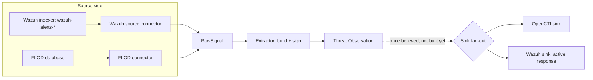

# Connector Expansion: OpenCTI and Wazuh

Design spec for this project's first real sink connectors, and its
second source connector, extending the *[source
connector](../glossary.md#source-connector)*/*[sink](../glossary.md#sink)*
pattern already built and proven in the Local Collection Layer (see
[2026-09-16-local-collection-pipeline-design.md](2026-09-16-local-collection-pipeline-design.md)).
Runs in parallel with the Federation Layer, not before or after it; see
[decision-record.md](../decision-record.md) for that sequencing call.
Terms in *italics* are defined in the [glossary](../glossary.md) the
first time they appear here.

## Goals

- Add a `SinkConnector` interface, symmetric to the existing
  `SourceConnector` one, so writing a believed observation out is the
  same shape of work as reading a raw signal in.
- Support fan-out to multiple configured sinks at once from the start
  (a node's platform, or several, and eventually its peers), per the
  standing decision recorded in project memory: nothing exists yet to
  constrain this design, so there is no cost to building it in now.
- Build two sink connectors against real, reachable systems this
  project can actually verify against: OpenCTI (already deployed in
  this project's own test VM) and Wazuh (a real server in the author's
  homelab, confirmed reachable, real alert data pulled and inspected
  while writing this spec).
- Add a second source connector, for Wazuh, proving the source
  connector interface generalizes past FLOD's single-table shape to a
  real system whose alert data has a genuinely heterogeneous structure.
- Never share destination-side information. Only the suspected
  threat's own address is shareable; which of a node's own internal
  hosts was targeted is that institution's business, not a peer's.
  This already holds for FLOD (`dst_ip` is deliberately excluded, see
  the Local Collection spec) and applies identically here.

## Non-goals (later milestones, not this one)

- Wiring the Wazuh sink connector into an automatic Local Action layer.
  That layer does not exist yet; this milestone builds and proves the
  connector works against the real Wazuh active-response mechanism,
  callable directly, not triggered automatically by a believed-observation
  event that nothing yet produces.
- Wiring either sink into the Peer Validation Layer's "believed" event.
  That layer does not exist yet either. Both sinks are tested standalone,
  called directly with a `ThreatObservation` built the same way Task 9's
  end-to-end test already builds one.
- Building connectors for any CTI platform beyond OpenCTI and Wazuh. See
  [decision-record.md](../decision-record.md) for why the scope stops
  there: this project holds every connector to being verified against a
  real, reachable system, and no other platform has one available.
- A brute-force detector built from scratch for the attack-scenario
  work. The Wazuh source connector reads real alerts, including real
  authentication-related ones, but designing the specific brute-force
  attack scenario and its VM-testbed traffic generation is separate,
  already-scoped future work (see the roadmap's attack-scenario-scope
  decision), not part of this connector spec.

## Components

```
collection/
  sinks/
    base.py       # the sink interface every destination implements
    opencti.py     # writes a believed observation into OpenCTI
    wazuh.py        # writes a believed observation into Wazuh's active response
  sources/
    wazuh.py         # reads Wazuh's own alerts, yields RawSignals
```

Everything else (`schema.py`, `extractor.py`, `config.py`, `keys.py`,
`sources/base.py`, `sources/flod.py`) is unchanged; this spec only adds
to the tree, it does not modify the Local Collection Layer's own pieces.

### Sink connector interface (`sinks/base.py`)

```python
class SinkConnector(Protocol):
    def send(self, observation: ThreatObservation) -> None: ...
```

One method, mirroring `SourceConnector.iter_signals` in spirit: a small
interface, no shared base class, nothing a concrete sink has to inherit
from. Fan-out to several configured sinks is the caller's job, not this
interface's: whatever eventually calls sinks (the Peer Validation
Layer's "believed" handler, once it exists) holds a `list[SinkConnector]`
and calls `.send()` on each, catching and logging a failure from one
sink without letting it block the others, the same per-item containment
pattern `extractor.run()` already uses for per-signal failures.

### OpenCTI sink (`sinks/opencti.py`)

Writes a believed `ThreatObservation` into OpenCTI over its GraphQL API,
as an indicator carrying the observation's indicator value, type,
evidence, and the reporting node's fingerprint as an external
reference. Authenticates with a bearer token (OpenCTI's own
`OPENCTI_ADMIN_TOKEN`-style credential, read through `config.py`'s
existing env-first pattern, not the deploy stack's own `.env`, this
component's own separate credential).

The exact GraphQL mutation and field mapping are grounded against the
running instance's own introspected schema during implementation, not
guessed here, the same discipline `FlodConnector` was built with
against FLOD's real `stage2/schema.py`. What's settled at the spec
level: which `ThreatObservation` fields map to which STIX concept
(indicator pattern from `indicator_value`, labels from
`indicator_type`/`source_verdict`, a description built from `evidence`
and `severity`/`confidence` once those are populated), not the literal
mutation string.

### Wazuh source (`sources/wazuh.py`)

Reads from the Wazuh indexer's `wazuh-alerts-*` index pattern (an
OpenSearch-compatible REST API, confirmed reachable and queried
directly while writing this spec against a real homelab server running
Wazuh 4.14.7) and yields one `RawSignal` per alert that clears a
configured minimum severity.

Unlike FLOD's single, fixed-schema `logs` table, Wazuh's alert `data`
field genuinely varies in shape by which rule and decoder fired,
confirmed empirically: a Security Configuration Assessment alert's
`data` carries a nested `sca.check.*` compliance-check structure with
no `srcip` at all, while an SSH-related alert's `data` carries
`srcip`/`dstuser`/`srcport` directly. This connector cannot assume one
field layout the way `FlodConnector` could. It:

- Filters to `rule.level >= CTI_WAZUH_MIN_RULE_LEVEL` (default `10`,
  Wazuh's own threshold separating genuinely suspicious activity from
  routine compliance/configuration noise, confirmed against real data
  pulled from the live server), configurable per the project's
  no-hardcoded-values rule, not fixed at one magic number.
- Reads `data.srcip` when present as the shareable `source_address`.
  An alert whose `data` carries no source-address field at all (the SCA
  shape, for instance) is not something this connector can turn into a
  useful Threat Observation and is skipped, not forced into a signal
  with a missing or fabricated address.
- Never reads any destination-side field (`dstip`, `dst_ip`, a target
  hostname, or similar) into anything that leaves this node.
  `evidence` only ever carries source-side and attack-characteristic
  fields, confirmed field by field during implementation against real
  alert samples, not assumed from documentation.
- Carries the attack type and technique through, since Wazuh's own
  alerts already have it: `rule.description`, `rule.groups`, and
  `rule.mitre.{tactic, technique, id}`, confirmed present in real data
  pulled from the live server while writing this spec, map directly
  into `evidence`.

**What gets left out on purpose, beyond destination-side data:**
remediation guidance. OpenCTI, and CTI platforms generally, already
ingest MITRE ATT&CK's own courses-of-action data as part of their
knowledge base, matching a technique to what to do about it is exactly
that kind of platform's job. This project's Threat Observation format
stays a minimal, "STIX-lite" carrier of what was observed; generating or
storing remediation guidance here would duplicate work a real sink
already does well, the same reasoning that kept the node dashboard from
rebuilding a CTI platform's own browsing UI.

**Not re-reading the same alerts on every run.** FLOD's own spec left
this as an open item, since FLOD's database is read in one pass and the
tool wasn't yet a repeated process. Wazuh's alert index is genuinely
continuous and growing, so this connector tracks a high-water mark, the
timestamp of the newest alert it has already turned into a signal,
persisted at a resolved path (`CTI_WAZUH_STATE_PATH`, same env-first
pattern as everything else in `config.py`), and only queries for alerts
newer than that mark on each run.

### Wazuh sink (`sinks/wazuh.py`)

Writes a believed `ThreatObservation` into Wazuh's own active-response
mechanism, over the Wazuh manager's REST API (confirmed reachable on
the same real server, a separate credential and port from the indexer
API used by the source connector). Calling `send()` triggers Wazuh's
built-in `firewall-drop` active response against the observation's
`indicator_value`, the concrete hook the future Local Action layer is
meant to use once it exists.

## Data flow



The dotted line marks the boundary this milestone does not cross: the
"once believed" trigger belongs to the Peer Validation Layer, which
does not exist yet. Both sinks are built and tested standing alone,
called directly with a real signed `ThreatObservation`, not wired to
that trigger.

## Configuration

Extends `config.py`'s existing table with the same env-first, then
candidate, then plain-error pattern used for every value so far:

| Value | Environment variable | Notes |
|---|---|---|
| OpenCTI GraphQL URL | `CTI_OPENCTI_URL` | No candidate location; OpenCTI's own address is never guessed |
| OpenCTI API token | `CTI_OPENCTI_TOKEN` | Never logged, never written anywhere but held in memory for the request |
| Wazuh indexer URL | `CTI_WAZUH_INDEXER_URL` | e.g. `https://host:9200` |
| Wazuh indexer credentials | `CTI_WAZUH_INDEXER_USER`, `CTI_WAZUH_INDEXER_PASSWORD` | Separate credential store from the manager API, confirmed empirically (the manager API's own user does not authenticate against the indexer) |
| Wazuh manager API URL | `CTI_WAZUH_API_URL` | e.g. `https://host:55000` |
| Wazuh manager API credentials | `CTI_WAZUH_API_USER`, `CTI_WAZUH_API_PASSWORD` | Used by the sink connector's active-response calls |
| Wazuh alert high-water mark | `CTI_WAZUH_STATE_PATH` | Candidate default: `~/.local/share/cti-platform/wazuh-state.json` |
| Wazuh minimum rule level | `CTI_WAZUH_MIN_RULE_LEVEL` | Candidate default: `10` |
| Wazuh/OpenCTI TLS verification | `CTI_ALLOW_INSECURE_TLS` | Unset by default (verification on); explicitly opting out is required to talk to a self-signed homelab certificate, never silently skipped |

## Security

Per this project's standing checklist, extended for the first time this
component talks over a network:

- **Credentials never touch disk.** Every credential above is read from
  its environment variable at call time and held only in memory for the
  request that needs it, the same discipline already applied manually
  while gathering the real Wazuh data this spec is grounded in (no
  password was ever written to a file or committed during that
  exploration).
- **TLS verification defaults on.** A self-signed certificate (the real
  homelab server's own setup) fails closed unless `CTI_ALLOW_INSECURE_TLS`
  is explicitly set, never silently disabled the way an ad-hoc `curl -k`
  would.
- **Destination-side data never leaves this node.** Covered under Goals
  above; restated here because it is a security property (leaking a
  node's internal network topology to peers), not only a design
  preference.
- **Bounded reads.** Wazuh alert queries are paginated and bounded (a
  fixed page size, never an unbounded `_search` with no limit), the same
  principle already applied to FLOD's cursor-based streaming, adapted to
  an HTTP API's own pagination.
- **This is the first outbound network code in the `collection/`
  package.** Every module up to this point deliberately made none; this
  spec is where that changes, so each sink and the Wazuh source
  connector are the only modules in the package permitted to import an
  HTTP client, keeping the boundary explicit and network code out of
  every module that does not need it.

## Testing

- Fixture-based unit tests for the Wazuh source connector's rule
  filtering and field mapping, built from the real alert JSON shapes
  pulled from the live server while writing this spec (the SCA shape
  and the SSH/`srcip` shape at minimum), the same fixture-from-real-data
  discipline FLOD's connector tests already use.
- A test confirming an alert with no source-address field in its `data`
  is skipped, not forced into a malformed signal.
- A test confirming no destination-side field ever reaches a produced
  `RawSignal`'s `evidence`, run against a fixture alert that has one, so
  the exclusion is proven active, not just untriggered by a fixture that
  never carried one.
- A test confirming the high-water mark is actually respected: two runs
  against the same fixture data, the second producing zero new signals.
- Sink connectors need real systems to test against meaningfully; unit
  tests cover request construction and response handling against a
  mocked HTTP layer, and a manual verification step (mirroring the Local
  Collection Layer's real-FLOD-data check) confirms each sink against
  the real OpenCTI VM instance and the real Wazuh homelab server before
  this work is considered done.

## Open items for the next spec, not this one

- The exact OpenCTI GraphQL mutation, grounded against the live
  instance's introspected schema during implementation.
- Which specific Wazuh rule groups, beyond a bare `rule.level` cutoff,
  are worth their own dedicated handling (the real
  `authentication_failures` brute-force rules specifically, once the
  attack-scenario work needs them).
- How the future Peer Validation Layer's "believed" event actually
  invokes the sink fan-out; this spec builds the sinks callable directly,
  not the trigger that will eventually call them automatically.
