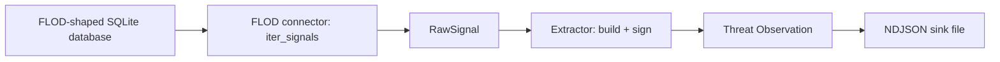

# Local Collection and Intelligence Extraction Pipeline

Design spec for the project's first buildable piece (roadmap weeks 3-4):
turning a raw signal from a local source into a signed
*[Threat Observation](../glossary.md#threat-observation)*, with no
*[federation](../glossary.md#federation)* or *[OpenCTI](../glossary.md#opencti)*
dependency yet. Terms in *italics* are defined in the
[glossary](../glossary.md) the first time they appear here.

## Goals

- Read a real *[node](../glossary.md#node)*'s local threat data and turn
  it into a shared, signed Threat Observation, proving the raw-signal
  to signed-observation path works end to end.
- Treat FLOD as the first of possibly several
  *[source connectors](../glossary.md#source-connector)*, not as
  something the core logic is written specifically around. Adding a
  second kind of source later (phishing, brute-force login attempts)
  should mean writing a new connector, not editing the extractor or the
  Threat Observation format.
- Work on any machine it's installed on: every filesystem path and
  configurable value is resolved at startup, never written into the code
  as a fixed value.
- Stay local and read-only. Nothing in this piece listens on a network
  port or writes to anything outside its own resolved output location.

## Non-goals (later milestones, not this one)

- Automated sorting/severity scoring (the classifier). This increment
  carries forward whatever verdict the source connector reports (for
  FLOD, its own detection label); it does not add a severity or
  confidence score of its own. Those fields exist in the Threat
  Observation format below but stay empty until the classifier milestone
  fills them in.
- A person reviewing or overriding anything. There is no queue yet.
- Talking to peers, or to OpenCTI. The output goes to a local file only.
- A long-running process that watches for new data continuously. This
  piece processes what's available in one pass, each time it's run.

## Components

```
collection/
  sources/
    base.py       # the connector interface every source implements
    flod.py       # the first connector: reads a FLOD-shaped database
  schema.py        # the Threat Observation model, and signing
  extractor.py      # RawSignal -> Threat Observation -> signed -> written to the sink
  config.py         # all path/value resolution lives here, used by every other module
  keys.py           # generates/loads the node's own signing key pair
requirements.txt
scripts/
  install.sh
  uninstall.sh
  update.sh
```

### Source connector interface (`sources/base.py`)

A small interface every connector implements:

```python
class RawSignal:
    observed_at: float        # unix timestamp
    source_address: str       # the suspected threat's own address
    indicator_type: str       # e.g. "ddos-flood"
    source_verdict: str       # the label the source system itself gave this signal
    evidence: dict            # whatever measurements the source captured (rate, entropy, ...)

class SourceConnector(Protocol):
    def iter_signals(self) -> Iterator[RawSignal]: ...
```

`iter_signals` only yields signals worth sharing; filtering out
irrelevant rows (see the FLOD connector below) is the connector's job,
not the extractor's.

### FLOD connector (`sources/flod.py`)

Reads a FLOD-shaped SQLite database's `logs` table (the real table and
column layout, taken from FLOD's own `stage2/schema.py`, not assumed
from its docs) and yields one `RawSignal` per row whose `classification`
is an actual detection verdict: `Normal`, `Flash Crowd`, `DDoS`, or
`Anomalous`. Rows whose classification is `Blocked` or `Released` are
enforcement bookkeeping, not detections, and are skipped.

`Normal` rows are read but not yielded as signals; a normal-traffic
row isn't a threat observation. Everything else maps to a `RawSignal`
with `evidence` carrying `rate`, `entropy`, and `proto` from the row.

The database file is opened read-only, and its path is checked against
being a symlink before opening (see Security, below).

### Threat Observation (`schema.py`)

```python
class ThreatObservation:
    observation_id: str          # a fresh UUID per observation
    reporting_node_id: str       # this node's public key fingerprint
    observed_at: str             # ISO 8601, converted from the signal's unix timestamp
    indicator_type: str          # from the RawSignal
    indicator_value: str         # the suspected threat's own address (the shareable part)
    source_verdict: str          # the label the source system gave this signal
    evidence: dict                # the source's own supporting measurements
    severity: str | None          # empty until the classifier milestone
    confidence: float | None      # empty until the classifier milestone
    signature: str                 # Ed25519 signature over every field above
```

**What gets left out on purpose:** the row's `dst_ip` (which server, on
the reporting institution's own network, was targeted) is not included.
`indicator_value` (the suspected attacker) is the part meant to be
shared; which internal server was targeted is the reporting
institution's own business, not something peers need to see.

### Extractor (`extractor.py`)

For each `RawSignal` from a connector: build a `ThreatObservation`, sign
it with the node's own Ed25519 key, and append it as one line to the
resolved output sink, a
*[newline-delimited JSON](../glossary.md#newline-delimited-json-ndjson)*
file.

### Configuration and path resolution (`config.py`)

Every path or setting this component needs follows the same rule,
applied nowhere else but here so it's written once: check an environment
variable first; if that isn't set, check a short list of real,
documented install locations for that value; if none of those exist
either, report plainly that it wasn't found rather than guessing.

| Value | Environment variable | Candidate locations checked |
|---|---|---|
| FLOD database path | `CTI_FLOD_DB_PATH` | `/var/lib/flod/*.db` (FLOD's own documented install location) |
| Output sink path | `CTI_OBSERVATION_SINK` | `~/.local/share/cti-platform/observations.ndjson` |
| Signing key directory | `CTI_KEY_DIR` | `~/.local/share/cti-platform/keys/` |

### Signing keys (`keys.py`)

On first run, if no key pair exists at the resolved key directory, one
is generated and stored there (private key file permissions restricted
to the owner only). Every later run reuses the same key pair, so a
node's identity stays stable across runs.

## Data flow



## Security

Per this project's standing checklist (see the global engineering
preferences this repository follows):

- The FLOD database path is checked for being a symlink before it's
  opened, and opened read-only.
- Reading the database is bounded: rows are processed one at a time via
  a cursor, never loaded all at once into memory.
- "Database not found" and "database found but not readable by this
  user" are reported as two different, specific errors, since the fix
  for each is different (install FLOD vs. add this account to the right
  group).
- No network code exists anywhere in this component.
- Ed25519 signing uses the `cryptography` library rather than anything
  hand-rolled.

## Scripts

- **`scripts/install.sh`.** Checks for Python 3, creates
  `collection/.venv`, installs the pinned dependencies from
  `requirements.txt`, and generates the node's signing key pair if one
  doesn't already exist. Prints the resolved paths it's using (or which
  environment variables to set, if nothing was found) before finishing.
- **`scripts/uninstall.sh`.** Removes `collection/.venv`. Leaves the
  signing key pair and any already-written observations in place unless
  `--remove-keys` is passed, since a node's signing identity is not
  something to delete by accident.
- **`scripts/update.sh`.** Reinstalls dependencies from
  `requirements.txt` into the existing venv. Does not touch keys,
  config, or already-written output.

All three follow the same structure as FLOD's own scripts (banner
header comment, `set -euo pipefail`, colored `info`/`success`/`warn`/
`error` helpers), scaled down to what this component actually needs; no
systemd service is installed, since this component is not a
long-running process.

## Testing

- A fixture SQLite database built from FLOD's actual `CREATE TABLE`
  statements (copied from `stage2/schema.py`), seeded with a handful of
  realistic rows covering every classification value.
- One test per classification value, confirming `Normal` rows produce no
  signal, `Blocked`/`Released` rows are skipped, and `Flash Crowd`/
  `DDoS`/`Anomalous` rows each produce a correctly shaped
  `ThreatObservation`.
- A test confirming a symlinked database path is rejected before any
  read is attempted.
- A test confirming a produced observation's signature verifies against
  the node's own public key, and fails to verify if any field is
  altered afterward.
- A test confirming the output sink is genuinely append-only across two
  separate runs (the second run's observations don't overwrite the
  first's).

## Open items for the next spec, not this one

- Where the classifier's severity/confidence scores get written back
  into an existing `ThreatObservation` once that milestone exists.
- What "re-running against the same rows twice" should do once this
  becomes a repeated, not one-shot, process (tracking a high-water mark
  so old rows aren't re-emitted). Out of scope while this stays a
  single-pass tool.
